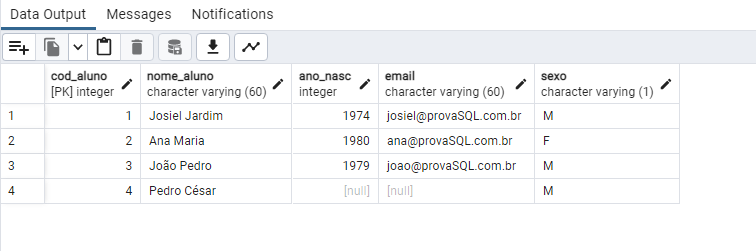
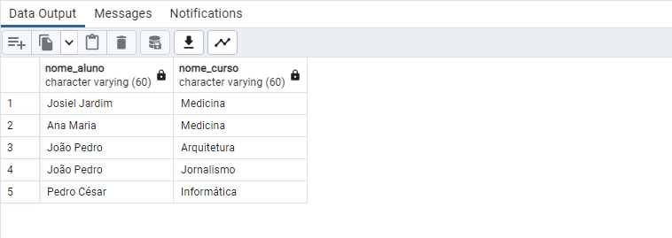
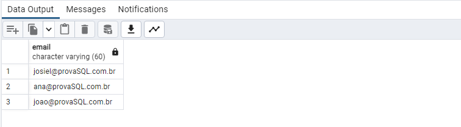
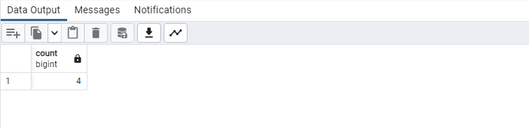
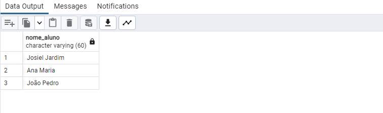
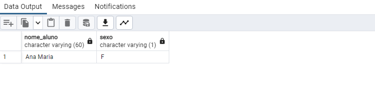
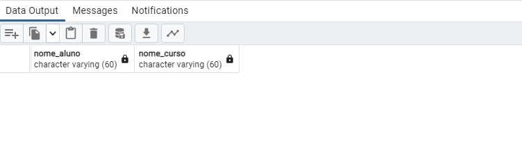
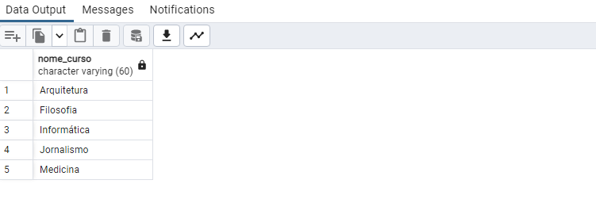
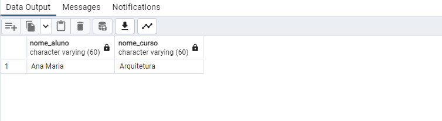

# Prova de SQL

### Criação das tabelas ⌨

```
create table tb_aluno (
	cod_aluno int primary key,
	nome_aluno varchar(60) not null,
	ano_nasc int,
	email varchar(60),
	sexo varchar(1) not null
)
```

```
create table tb_curso(
	cod_curso int primary key,
	nome_curso varchar(60) not null
)
```

```
create table tb_matricula(
	cod_curso int references tb_curso(cod_curso),
	cod_aluno int references tb_aluno(cod_aluno)
)
```

### 💾 Inserindo os dados das tabelas 💾 

```
insert into tb_aluno(cod_aluno,nome_aluno,ano_nasc,email,sexo)
values(1, 'Josiel Jardim', '1974','josiel@provaSQL.com.br','M');
values(2, 'Ana Maria', '1980','ana@provaSQL.com.br','F');
values(3, 'João Pedro', '1979','joao@provaSQL.com.br','M');
```

```
insert into tb_curso(cod_curso, nome_curso)
values(1, 'Medicina')
values(2, 'Arquitetura')
values(3, 'Filosofia')
values(4, 'Informática')
values(5, 'Jornalismo')
```

```
insert into tb_matricula(cod_curso, cod_aluno)
values(1, 1)
values(1, 2)
values(2, 3)
values(5, 3)
```

### Respondendo as questões praticas:

1. Faça um comando SQL para matricular o aluno “Pedro César” no curso de Informática. Os dados devem ser inseridos na tabela TB_MATRÍCULA.

```
insert into tb_aluno(cod_aluno,nome_aluno,ano_nasc,email,sexo)
values(4, 'Pedro César', NULL, null,'M');
```



2. Escreva um comando SQL que retorne os nomes dos alunos e do(s) cursos em que estão matriculados. Os dados deverão estar ordenados pelo nome do curso.

```
select tb_aluno.nome_aluno, tb_curso.nome_curso
FROM tb_aluno
INNER JOIN tb_matricula
ON tb_aluno.cod_aluno = tb_matricula.cod_aluno
INNER JOIN tb_curso
ON tb_curso.cod_curso = tb_matricula.cod_curso
```



3. Crie um comando SQL que retorne o e-mail de todos os alunos maiores de idade.

```
select email
from tb_aluno where 2022 - ano_nasc >= 18
```



4. Desenvolva um comando SQL que mostre o total de alunos.

```
select count(cod_aluno)
from tb_aluno 
```



5. Escreva um comando SQL para listar o total de alunos matriculador em cada curso.

'Não consegui resonder.'

6. Desenvolva um comando SQL que retorne o nome de todos os alunos maiores que 18 anos.

```
select nome_aluno
from tb_aluno where 2022 - ano_nasc >= 18 
```



7. Faça um comando SQL que retorne o nome de todas as mulheres.

```
select nome_aluno, sexo
from tb_aluno where sexo = 'F'
```



8. Faça um comando SQL que retorne o nome de todas as mulheres matriculadas no curso de Medicina.

```
select tb_aluno.nome_aluno, tb_curso.nome_curso
from tb_aluno
inner join tb_curso
on tb_aluno.cod_aluno = tb_curso.cod_curso
where nome_curso = 'Medicina' and sexo = 'F'
```



9. Faça um comando SQL que retorne os nomes dos cursos ordenados por ordem alfabética.

```
select nome_curso
from tb_curso order by nome_curso asc
```



10. Crie o enunciado de uma consulta SQL que utilize “junção” (com resposta).

* Mostre o nome de todos os alunos matriculados em arquitetura

```
select tb_aluno.nome_aluno, tb_curso.nome_curso
from tb_aluno
inner join tb_curso
on tb_aluno.cod_aluno = tb_curso.cod_curso
where nome_curso = 'Arquitetura'
```



### Respondendo as questões teoricas:

1. Defina: SQL.

Resumidamente, é uma linguagem de programação para lidar com banco de dados relacional (baseado em tabelas). Foi criado 
para que vários desenvolvedores pudessem acessar e modificar dados de uma empresa. É o acrônimo para Structured Query Language, 
para acesso e manipulação de dados, principalmente para banco de dados relacionados.

2. Faça um relacionamento cronológico sobre SQL.

O SQL foi originalmente desenvolvido  no início dos anos 1970 no IBM Labs. O nome original da linguagem era SEQUEL, que significa "Structured English Query Language". No início dos anos 1980, o American National Standards Institute (ANSI) começou  a trabalhar no desenvolvimento de uma versão padrão do SQL que foi publicada em 1986. 
Desde então, o SQL passou por melhorias importantes e outras alterações e adições até os dias atuais, até agora, tornou-se a linguagem  padrão para bancos de dados.

3. Liste as principais caracteríticas de SQL.

- Possui sintaxe e semântica próprias que tenta se aproximar à língua inglesa.

- Utilizada tanto por programadores"normais" tanto também pelos Administradores do Banco de Dados.

- Permite fazer uma série de operações de inclusão, de pesquisa e de definição de dados.

- Possui linguagem do tipo declarativa.

4. Descreva a sintaxe do comando SQL: SELECT. Quais cláusulas são obrigatórias e quais são opcionais?

O comando Select deve conter o nome do campo que deve ser retornado, de qual tabela e quando contêm a claúsula WHERE, as 
condições que o registro deve obedecer para retornar os valores. Uma expressão básica em SQL consiste em três cláusulas 
obrigatórias: SELECT, FROM e WHERE. A cláusula SELECT corresponde à operação de projeção da álgebra relacional. É usada para 
relacionar os atributos desejados no resultado de uma consulta. As cláusulas apcionais são: INNER JOIN, ORDER BY, GROUP BY, ASC, 
DESC.

5. Qual a importância da linguagem SQL no desenvolvimento de softwares atualmente? Justifique.

O SQL é bem importante no desenvolvimento de softwares, já que as consultas e o gerenciamento de dados se tornam bem mais dinâmicas. 
Aprendê-la permite entrar em contato com os dados na fonte e é uma linguagem bem simples de se aprender.
